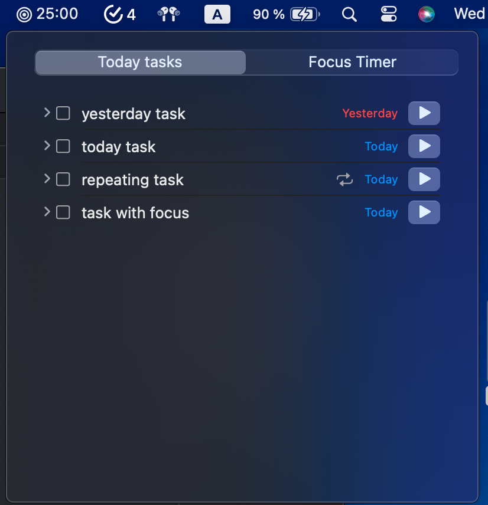
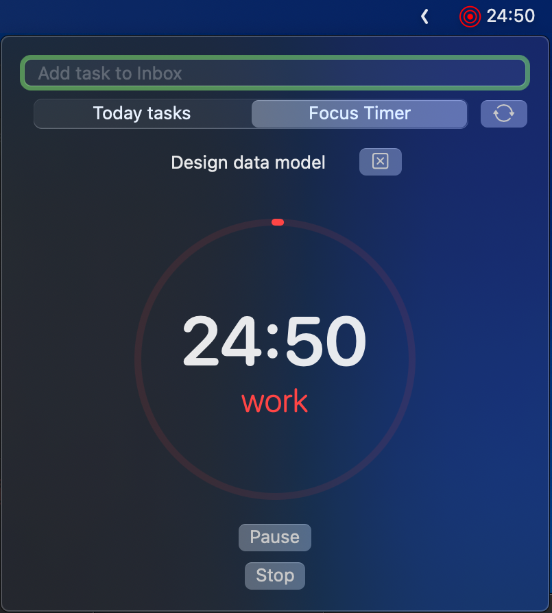

# PomPadDo

PomPadDo is a personal task manager / planner app  
made to myself by myself

<!---
--->

## macOS app
<!-- --->

### Roadmap
- [x] Add task direct to Inbox
- [x] Projects review
- [x] Project board view
- [x] Repeating tasks 
- [x] Notifications
- [x] Focus timer
- [ ] Location based contexts
- [x] iOS / iPadOS implementation
- [ ] watchOS companion app
- [x] Sync via iCloud
- [x] Settings for focus timer's factors and estimates
- [x] Localization
- [x] Safari extension
- [x] Add event to Calendar from task

#### Languages Supported
- English 🇺🇸
- Russian 🇷🇺
