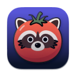
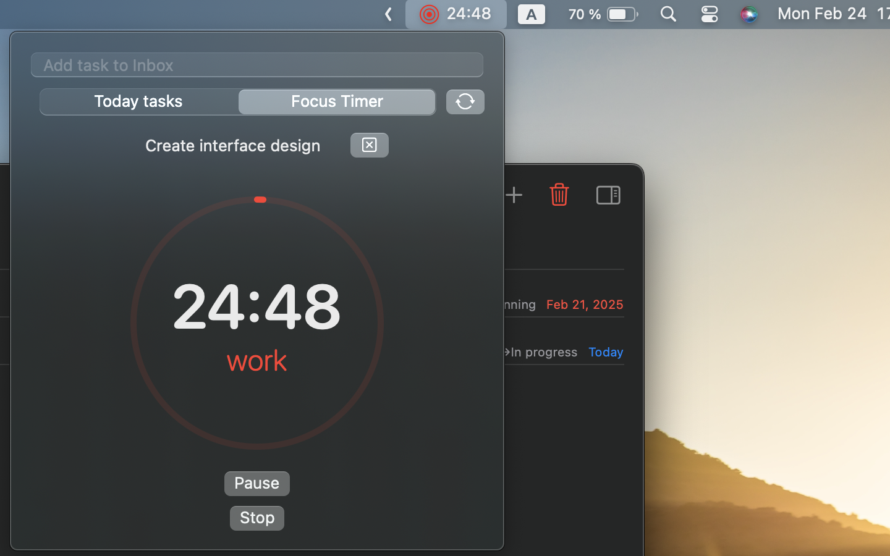
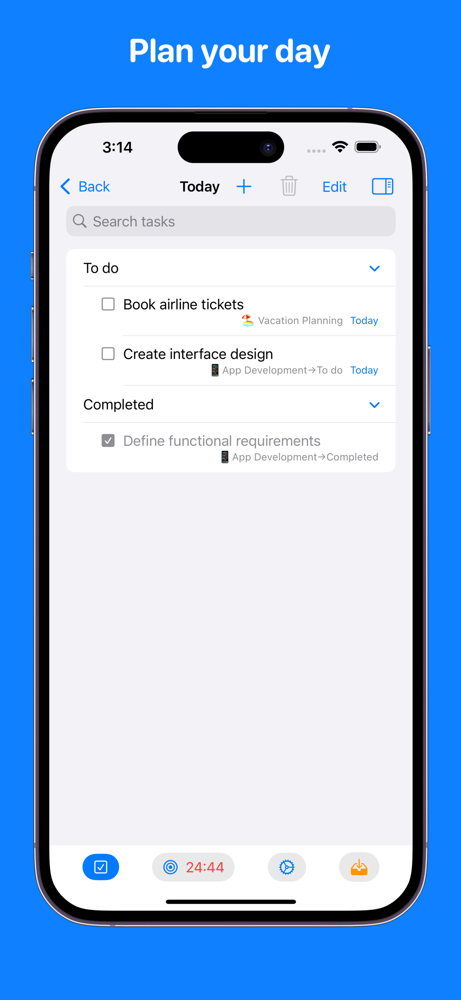
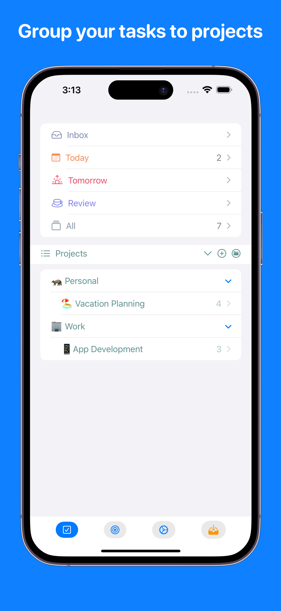
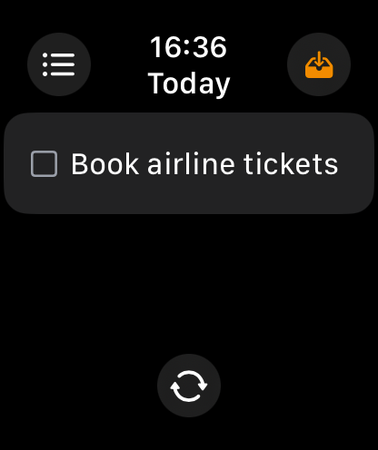

# PomPadDo

PomPadDo is a personal task manager / planner app  
made to myself by myself

<!--- --->

Manage projects, stay focused, and sync progress across devices — all in one app designed specifically for freelancers and solo workers.

🌟 Key Features:  
✅ Flexible Task Lists 
Prioritize tasks, add subtasks. No detail slips through the cracks.  
✅ Kanban Boards for Projects 
Visualize workflows from idea to completion. Drag and drop cards, customize statuses, and track progress. 
✅ Regular Project Reviews 
Conduct weekly or monthly check-ins. Celebrate wins, adjust plans, and stay on track. 
✅ Built-in Focus Timer 
Work in cycles: 25 minutes of focus + 5 minutes of rest. Beat procrastination and boost efficiency. 
✅ Instant iCloud Sync 
Your tasks and projects stay updated across iPhone, iPad, Mac, and Apple Watch. 

💡 Why PomPadDo? 
We’ve combined the best of task management and productivity techniques so you can:

Plan without chaos, 
Track projects visually, 
Focus without distractions, 
Sync seamlessly across devices. 

🚀 Perfect for:

Freelancers, 
Designers, developers, writers, 
Students and anyone craving order in their workflow.

## macOS app
<!-- --->

 
 
 

## iOS / iPadOS app

## watchOS companion app

### Roadmap
- [x] Add task direct to Inbox
- [x] Projects review
- [x] Project board view
- [x] Repeating tasks 
- [x] Notifications
- [x] Focus timer
- [x] iOS / iPadOS implementation
- [x] watchOS companion app
- [x] Sync via iCloud
- [x] Settings for focus timer's factors and estimates
- [x] Localization
- [x] Safari extension
- [x] Add event to Calendar from task
- [ ] Location based contexts

#### Languages Supported
- English 🇺🇸
- Russian 🇷🇺
