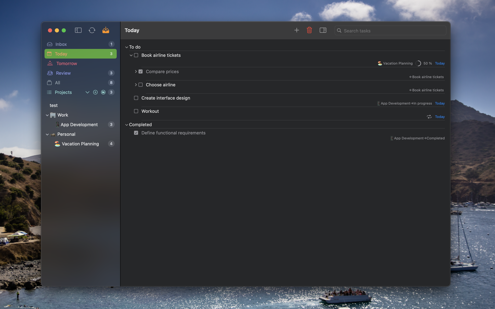
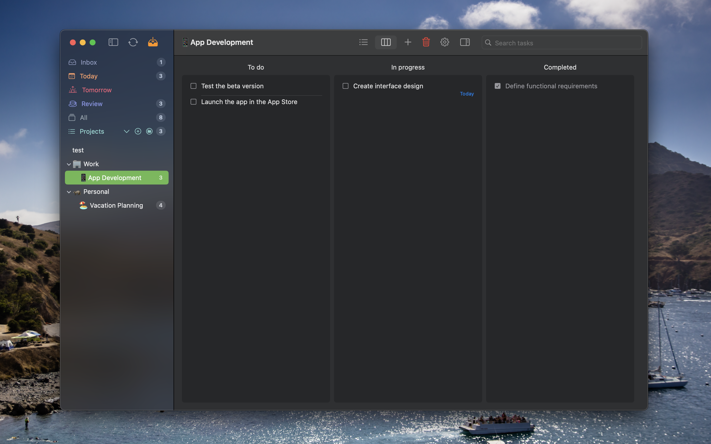
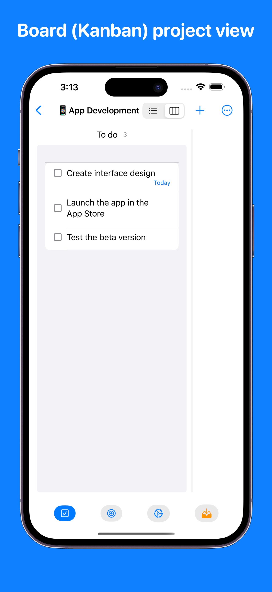
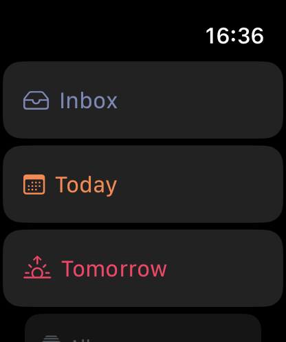
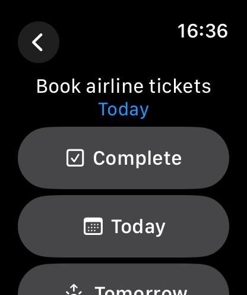

# PomPadDo

PomPadDo is a personal task manager / planner app  
made to myself by myself

 

Sometimes tasks pile up so quickly that it's hard to figure out where to start. PomPadDo combines three proven methodologies - GTD, Pomodoro, and Kanban - in one simple app to help you get it all done.

Key features:
- Global Inbox: Add your thoughts to your Inbox from anywhere in the app
- Projects review: Review your projects periodically
- Project board view: Show a project as a board (Kanban) or a list
- Sync: Sync across devices via iCloud
- Focus timer: Focus on a task for a set amount of time

## macOS app
<!-- --->

 
 
 

## iOS / iPadOS app

## watchOS companion app

### Roadmap
- [x] Add task direct to Inbox
- [x] Projects review
- [x] Project board view
- [x] Repeating tasks 
- [x] Notifications
- [x] Focus timer
- [x] iOS / iPadOS implementation
- [x] watchOS companion app
- [x] Sync via iCloud
- [x] Settings for focus timer's factors and estimates
- [x] Localization
- [x] Safari extension
- [x] Add event to Calendar from task
- [x] Deletion to Trash view
- [ ] Tags
- [ ] Shortcuts
- [ ] Live activities
- [ ] Location based contexts

#### Languages Supported
- English 🇺🇸
- Russian 🇷🇺

##### AI-based localizations
- Arabic
- Bulgarian 
- Catalan
- Chinese
- Croatian
- Czech
- Danish
- Dutch
- Finnish
- French
- German
- Greek
- Hebrew
- Hungarian
- Indonesian
- Italian
- Japanese
- Korean
- Latvian
- Lithuanian
- Malay
- Norwegian
- Persian
- Polish
- Portuguese
- Romanian
- Slovak
- Slovenian
- Spanish
- Swedish
- Tamil
- Thai
- Turkish
- Ukrainian
- Urdu
- Vietnamese

## Additional resources

[Shortcuts command](PomPadDo.shortcut)
